# RETINA - HERMAN KOLGEN #

## Présentation de l'exposition ##
La 6e Biennale internationale d'art numérique (BIAN 6) était présentée du 1er décembre 2022 au 5 février 2023 à Arsenal Art Contemporain Montréal. Cette exposition temporaire intérieure présentait diverses œuvres numériques et multimédias sous la thématique de la mutation. Une œuvre en particulier s’est démarquée lors de la visite du vendredi 3 février 2023.

### Affiches ###

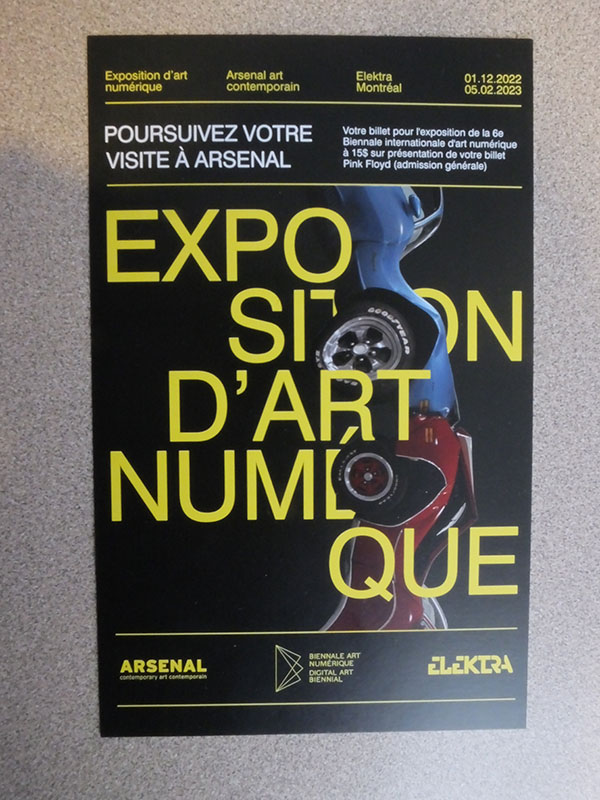
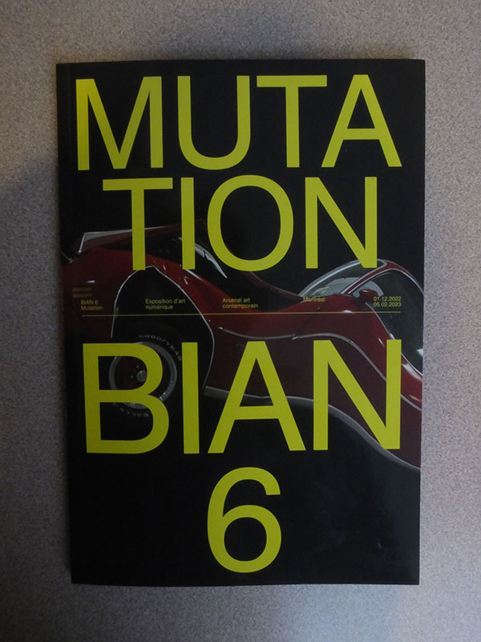

Photographies: Melody Chiasson
 
  
 
## Présentation de l'oeuvre ##
L’œuvre Retina a été réalisée par l’artiste Montréalais Herman Kolgen en 2021. Retina est une œuvre numérique, combinant audio et images en mouvement (pouvant être présenté sous forme de 3 et 6 canaux vidéo) dans laquelle l’artiste s’interroge sur « combien d’images notre acuité visuelle aura-t-elle enregistrées, produites et compilées tout au long de notre vie, elle qui, dépendant de la lumière, interprète à chaque instant des fragments du monde? ». 

Source : http://kolgen.net/fr/performances/retina-performance/

### Cartel ###

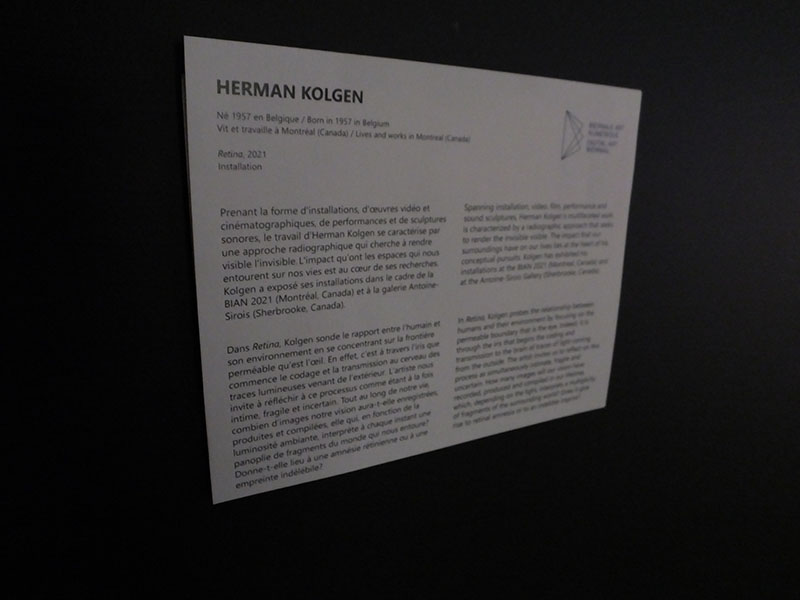

Photographie: Melody Chiasson

 

### Retina ###

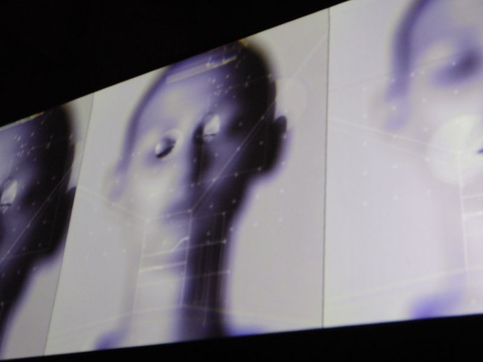

Photographie: Melody Chiasson

 

### Vidéo ###

Vidéo: Melody Chiasson

 
 
 ## Installation ##
 
Retina est une installation de type principalement contemplative puisque c’est une projection que les visiteurs doivent visionner en continu pendant environ 10 à 15 minutes. Elle peut être interprétée comme étant immersive par sa nature à capter l’attention avec les images et la lumière qui viennent inonder l’œil et le cerveau d’informations et de sensations selon l'expérience vécue par le visiteur.

L'oeuvre est projetée sur une toile d'environ trois mètres de largeur. Deux projecteurs sont utilisés; un pour la projection vidéo et un deuxième plus petit pour la projection du rayon laser. Cette toile est accrochée à une structure de métal à l'aide de quatre câbles et celle-ci est accrochée au plafond avec deux gros câbles. Deux haut-parleurs sont suspendus aux extrémités de cette structure. Les fils sont cachés dans cette dernière et vont rejoindre les murs pour passer dans d'autre cache-fils. Un rideau noir opaque est installé sur support vertical à la gauche de la toile; un demi-mur se trouve derrière et le mur du bâtiment se trouve à la droite de l'espace de projection. Un banc de cuir se trouve en face de la toile, devant un autre demi-mur qui vient compléter le périmètre de Retina. Deux haut-parleurs se trouvent au sol, dans les coins de l'espace derrière la toile. Le plafond est à aire ouverte et le cartel se trouve au mur à l'entrée du périmètre, près du rideau.

### Éléments ###

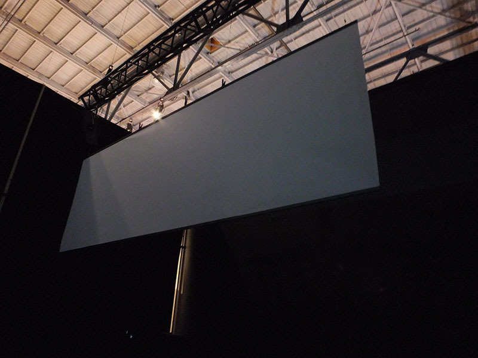
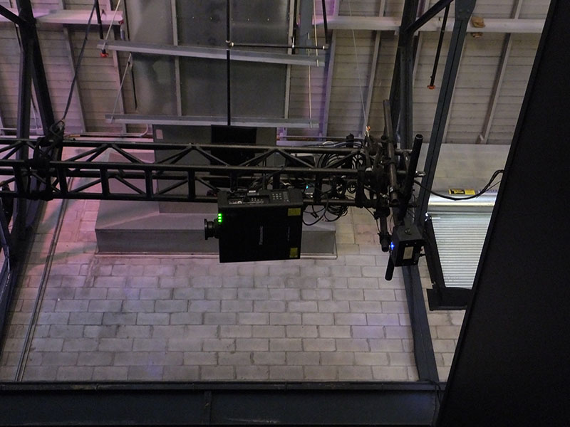
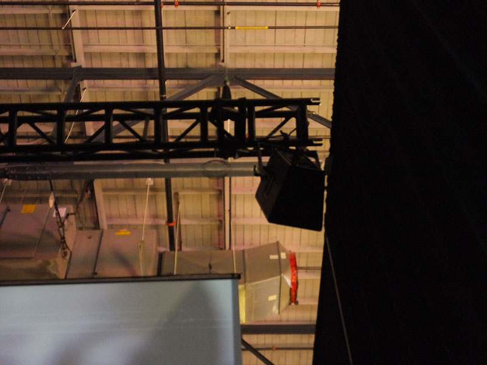
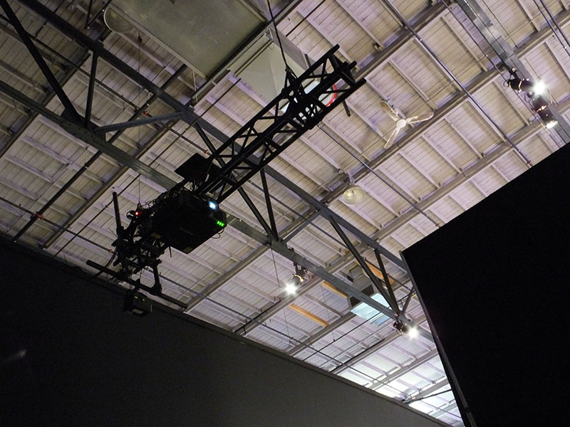
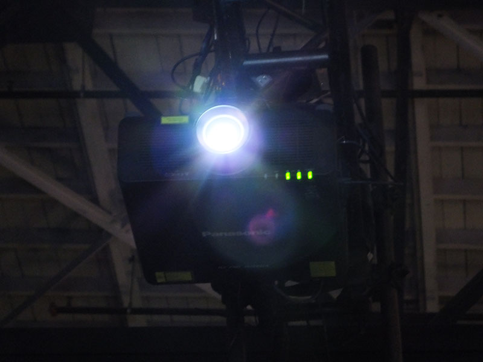
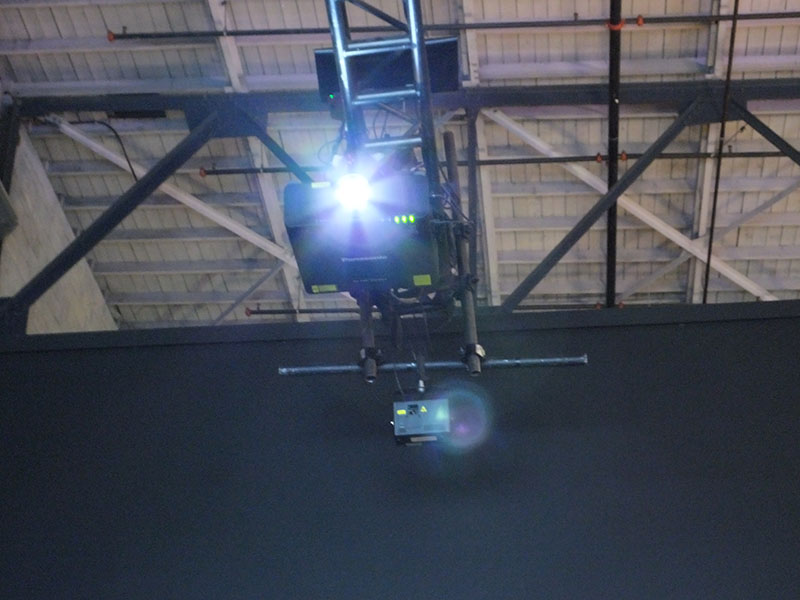

Photographies: Melody Chiasson

 

### Vidéos ###

Vidéos: Melody Chiasson

 

### Croquis ###

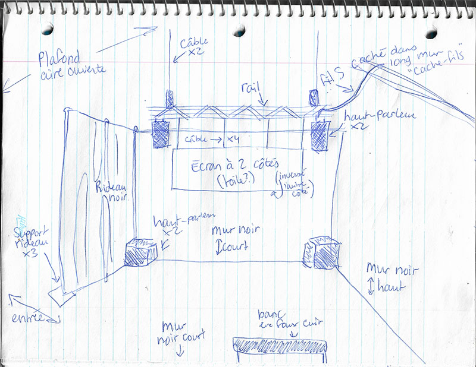
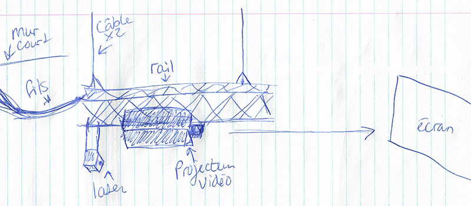

Croquis: Melody Chiasson

 
 
 ## Expérience vécue ##
 
En assistant à la projection de l’œuvre Retina, j’ai ressenti beaucoup de curiosité dès mon premier contact avec celle-ci. Tant par les éléments visuels qui étaient projetés que par l’ambiance sonore assez frappante. J’ai par la suite continué ma visite de l’exposition, mais mon choix s’est finalement arrêté sur cette œuvre puisque j’avais plusieurs questionnements et le désir de décoder le message de l’artiste. 

Je me suis sentie hypnotisée par moment et même en immersion. J’ai aimé les passages dans lesquels les images se succédaient rapidement en même temps que le rayon laser qui dessinait des formes et écrivait des phrases par-dessus la projection. Il y avait beaucoup de flashs lumineux et j’avais l’impression que mes yeux se faisaient scanner par l’œuvre. 

J’ai trouvé que l’artiste a bien réussi à transmettre son intention de nous amener à nous questionner sur ce que perçoivent nos yeux dans notre environnement, versus ce que nous sommes capables de déchiffrer et enregistrer dans notre mémoire, ce qui peut influencer nos perceptions et sensations.

Cependant, j'aurais personnellement préféré que l'écran ou la toile sur laquelle l'œuvre était projetée soit beaucoup plus grand afin de mieux percevoir les détails et de se sentir plus en immersion. 

Un autre point que j'aurais amélioré selon moi serait que l'emplacement de l'œuvre soit dans un espace plus intime et fermé, avec davantage de bancs ou de sièges individuels. J'ai trouvé dommage qu'il n'y ait qu'un seul banc, assez large pour accueillir une ou deux personnes, ce qui ne convient pas au fait de devoir assister à une projection d'environ 10-15 minutes. De plus, ce banc se trouvait directement en face de l'entrée de l'espace de l'exposition, ce qui pouvait déconcentrer pendant le visionnement de la projection. 

En terminant, j'aurais trouvé intéressant si l'artiste avait utilisé les rayons lasers pour écrire et faire des motifs sur le sol ou les murs afin d'accentuer davantage le thème de l’œuvre, qui se décrit comme voulant explorer la frontière entre ce que perçoit l’œil dans son environnement et ce que le cerveau enregistre comme information.

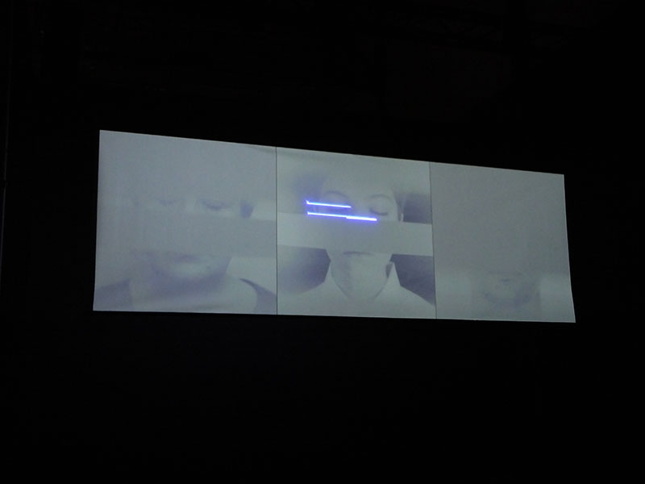

Photographie: Melody Chiasson
