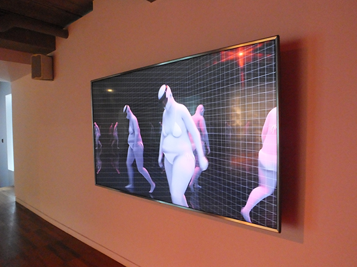
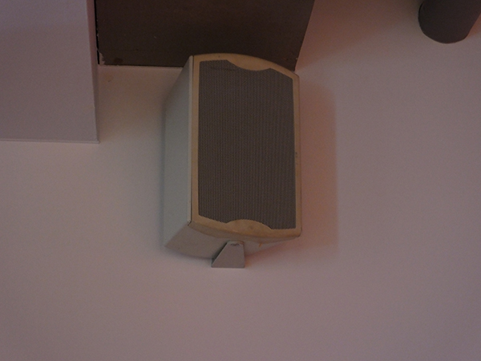
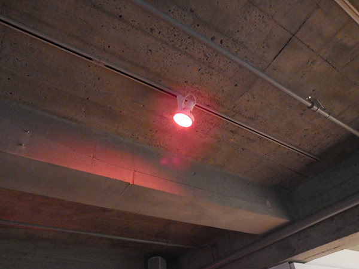
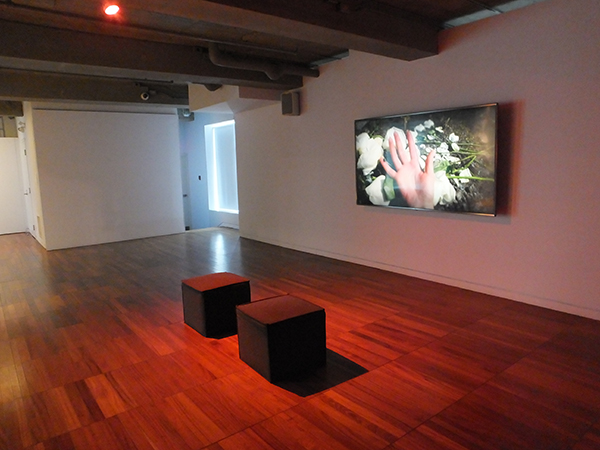
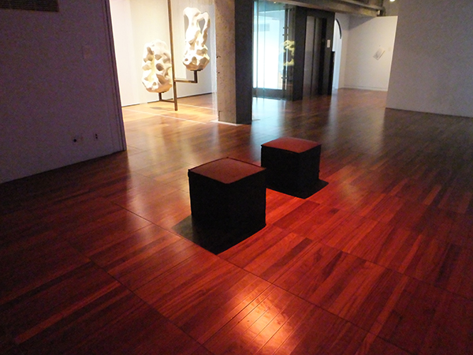
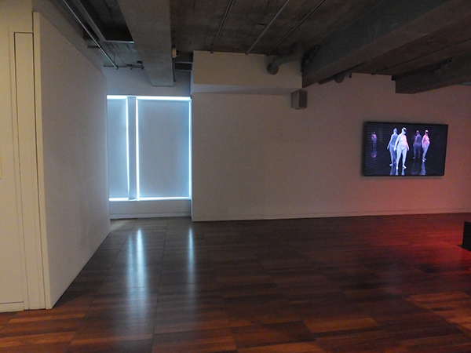

# Unholy Ghost – Mara Eagle #

## Présentation de l'exposition ##
L’exposition Conditions d’utilisation est présentée du 9 mars au 9 juillet 2023 à la Fondation PHI à Montréal. Cette exposition intérieure temporaire présente des œuvres numériques ainsi que des œuvres réalisées avec l’aide des technologies récentes. L’exposition se décrit comme tel sur la page web de la Fondation PHI : 
> « Conditions d’utilisation rassemble des œuvres qui explorent l’impact qu’ont les technologies sur la définition, la construction et le (re)cadrage des identités individuelles et collectives, alors que nous vivons simultanément en ligne et AFK (away from keyboard, expression anglaise qui se traduit par « loin de son clavier »). 
 
Source : https://phi.ca/fr/evenements/conditions-dutilisation/

## Exposition ##

Photographies: Melody Chiasson
  
  
## Présentation de l'oeuvre ##
L’œuvre Unholy Ghost a été réalisée par l’artiste Mara Eagle en 2023. Unholy Ghost est une œuvre numérique et physique, combinant une vidéo de 5 minutes et 45 secondes ainsi que 4 sculptures imprimées d’un ange. 
 Selon une publication de la Fondation PHI sur Facebook, l’œuvre se décrit comme tel : 
> « Mélangeant animation 3D et prises de vue réelles, la vidéo de l’installation «Unholy Ghost» (2023) de Mara Eagle, médite sur les effets qu’a la reproductibilité technologique sur le corps d’une protagoniste qui oscille sans cesse entre deux espaces: l’un étant une chambre d’hôpital et l’autre, une expérience de réalité virtuelle. 
Sont aussi présentées dans l’installation des impressions 3D de chérubins en céramique qui font écho à des monuments funéraires captés par l’artiste au cours de son tournage, pointant vers un brouillage des frontières entre ce qui est fait par la machine et ce qui est fait à la main. »
 
Source : https://www.facebook.com/FondationPHI/posts/pfbid02mzHPAxC64xPRwpYkTwzcDoVuSpQCtKazpG8HVK4kXEZC3FL6QSmpybUPTxSJQFD8l
 
 

## Cartel ##

Photographie: Melody Chiasson
 
 

## Unholy Ghost ##

Photographie: Melody Chiasson
 
 

## Vidéo ##

Vidéo: Melody Chiasson

 
 
 
 ## Installation ##
 
L’installation de Unholy Ghost est présentée dans une aire ouverte se trouvant au 4e étage de la Fondation PHI, directement en face de la porte d’entrée de l’escalier qui mène à cet étage. Elle est constituée d’un téléviseur de marque LG accroché au mur à l’aide d’un support mural standard, mesurant environ 2 m de large par 1,5 m de hauteur. Les fils sont cachés derrière le téléviseur et ne sont pas visibles par le visiteur, à moins que celui-ci regarde derrière l’écran.
 
 
### Croquis de la vue de face, en entrant dans la pièce ###
 

Croquis: Melody Chiasson
 
 
Deux poufs carrés en tissus se trouvent en face du téléviseur pour permettre aux visiteurs de s’assoir pour regarder la vidéo. Il y a au total quatre haut-parleurs, dont deux se trouvant en hauteur, à gauche et à droite du téléviseur (en face du visiteur) et deux autres aussi en hauteur et à gauche et à droite, sur le mur en face du téléviseur (derrière le visiteur). Un luminaire avec un éclairage rouge se trouve au plafond pour illuminer les poufs.
 
 

### Téléviseur, haut-parleur et lumière ###
 

Photographies: Melody Chiasson
 
 

### Mise en espace ###

 

Photographies: Melody Chiasson
 
 
À la droite, le visiteur peut observer une étagère triangulaire accrochée au mur soutenant quatre statuettes d’ange. L’étagère mesure environ 2 m de largeur par 80 cm de hauteur, et la profondeur est d’environ 30 cm. Au sol, devant l’étagère, se trouvent deux petits poteaux reliés par un fil de fer, d’environ 30 cm de hauteur, qui servent de démarcation entre les statuettes et le visiteur sur une distance d’environ 1 m. Il y a quatre luminaires projetant un éclairage rouge qui illumine chacune des statuettes. Les fils sont cachés et les luminaires sont suspendus par rail.
 
 
### Croquis de la vue à droite, en entrant dans la pièce ###
 

Croquis: Melody Chiasson
 
 

### Statuettes ###

 

Photographies: Melody Chiasson
 
 

### Mise en espace ###

 

Photographies: Melody Chiasson
 
 

## Extrait ##

 
Vidéo: Melody Chiasson

