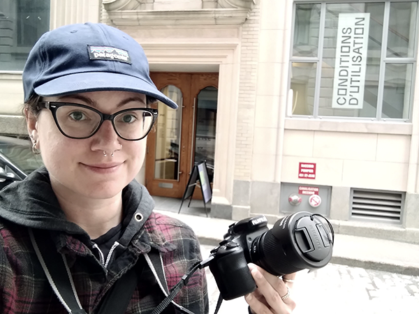

# Unholy Ghost – Mara Eagle #

## Présentation de l'exposition ##

L’exposition Conditions d’utilisation est présentée du 9 mars au 9 juillet 2023 à la Fondation PHI à Montréal. Cette exposition intérieure temporaire présente des œuvres numériques ainsi que des œuvres réalisées avec l’aide des technologies récentes. L’exposition se décrit comme tel sur la page web de la Fondation PHI : 
> « Conditions d’utilisation rassemble des œuvres qui explorent l’impact qu’ont les technologies sur la définition, la construction et le (re)cadrage des identités individuelles et collectives, alors que nous vivons simultanément en ligne et AFK (away from keyboard, expression anglaise qui se traduit par « loin de son clavier »). »
 
Source : https://phi.ca/fr/evenements/conditions-dutilisation/
 
 

## Exposition ##

 
 
 
## Présentation de l'oeuvre ##

L’œuvre Unholy Ghost a été réalisée par l’artiste Mara Eagle en 2023. Unholy Ghost est une œuvre numérique et physique, combinant une vidéo de 5 minutes et 45 secondes ainsi que 4 sculptures imprimées d’un ange. 
 Selon une publication de la Fondation PHI sur Facebook, l’œuvre se décrit comme tel : 
> « Mélangeant animation 3D et prises de vue réelles, la vidéo de l’installation «Unholy Ghost» (2023) de Mara Eagle, médite sur les effets qu’a la reproductibilité technologique sur le corps d’une protagoniste qui oscille sans cesse entre deux espaces: l’un étant une chambre d’hôpital et l’autre, une expérience de réalité virtuelle. 
Sont aussi présentées dans l’installation des impressions 3D de chérubins en céramique qui font écho à des monuments funéraires captés par l’artiste au cours de son tournage, pointant vers un brouillage des frontières entre ce qui est fait par la machine et ce qui est fait à la main. »
 
Source : https://www.facebook.com/FondationPHI/posts/pfbid02mzHPAxC64xPRwpYkTwzcDoVuSpQCtKazpG8HVK4kXEZC3FL6QSmpybUPTxSJQFD8l
 
 

 
 
 
 ## Installation ##
 
 
 
L’installation de Unholy Ghost est présentée dans une aire ouverte se trouvant au 4e étage de la Fondation PHI, directement en face de la porte d’entrée de l’escalier qui mène à cet étage. Elle est constituée d’un téléviseur de marque LG accroché au mur à l’aide d’un support mural standard, mesurant environ 2 m de large par 1,5 m de hauteur. Les fils sont cachés derrière le téléviseur et ne sont pas visibles par le visiteur, à moins que celui-ci regarde derrière l’écran.
 
 

## Croquis de la vue de face, en entrant dans la pièce ##

 
Deux poufs carrés en tissus se trouvent en face du téléviseur pour permettre aux visiteurs de s’assoir pour regarder la vidéo. Il y a au total quatre haut-parleurs, dont deux se trouvant en hauteur, à gauche et à droite du téléviseur (en face du visiteur) et deux autres aussi en hauteur et à gauche et à droite, sur le mur en face du téléviseur (derrière le visiteur). Un luminaire avec un éclairage rouge se trouve au plafond pour illuminer les poufs.
 
 

## Installation ##
Téléviseur, haut-parleur et lumière
 

 
 

## Mise en espace ##

 
À la droite, le visiteur peut observer une étagère triangulaire accrochée au mur soutenant quatre statuettes d’ange. L’étagère mesure environ 2 m de largeur par 80 cm de hauteur, et la profondeur est d’environ 30 cm. Au sol, devant l’étagère, se trouvent deux petits poteaux reliés par un fil de fer, d’environ 30 cm de hauteur, qui servent de démarcation entre les statuettes et le visiteur sur une distance d’environ 1 m. Il y a quatre luminaires projetant un éclairage rouge qui illumine chacune des statuettes. Les fils sont cachés et les luminaires sont suspendus par rail.
 
 

## Croquis de la vue à droite, en entrant dans la pièce ##

 
 

## Installation ##
Luminaires, anges, démarcation
 

 
 

## Statuettes ##

 
 

## Aperçu vidéo de la mise en espace ##

 
 

## Expérience vécue ##
En entrant dans la salle, le visiteur voit en premier le téléviseur ainsi que les poufs et par la suite, l’étagère avec les statuettes. Le visiteur peut choisir d’aller regarder la vidéo ou les statuettes à sa guise et peut choisir de s’assoir ou non pour apprécier l’œuvre puisque cela n’a pas d’incidence sur l’expérience vécue. 
Selon mon expérience, j’ai préféré m’assoir pour regarder la vidéo et ensuite je me suis levée pour regarder les statuettes. Par la suite, j’ai préféré rester debout lors d’un deuxième visionnement de la vidéo.
 
 

## Aspects positifs ##
J’ai bien aimé le fait que l’œuvre est installée dans une grande aire ouverte, je me sentais plus libre d’apprécier l’œuvre comme bon me semble et de pouvoir prendre le temps de circuler pour regarder les statuettes et analyser l’environnement. Même lorsque d’autres visiteurs étaient présents, je me sentais libre de contempler l’œuvre sans me sentir envahissante ou envahie par la présence d’étrangers. J’ai aimé la thématique de liens entre la vie et la mort mélangées à la vie virtuelle et réelle. J’ai bien aimé les parties vidéos filmées à l’extérieur dans un cimetière, les effets utilisés dans le montage et la bande sonore.
 
 

## Aspects négatifs ##
Malgré le fait que la vidéo jouait en boucle, il était facile de repérer la coupure puisqu’elle n’était pas bien intégrée dans le montage. Il y avait aussi des défauts d’exécution dans l’animation 3D, qui, selon moi, n’était pas recherchée comme effet. J’ai trouvé que ça donnait un aspect un peu bâclé et accrochait mon regard et mon attention envers ces aspects, plutôt que de me laisser plonger dans l’œuvre. Je n’ai pas vraiment compris le lien entre la vidéo et les quatre statuettes identiques d’anges, j’ai trouvé que c’était superflu.
 
 

## Extrait vidéo de l'oeuvre ##

 
 
## Sources médias ##
Photographies, vidéos et croquis: Melody Chiasson (sauf indication contraire).

