# Unholy Ghost – Mara Eagle #

## Présentation de l'exposition ##
L’exposition Conditions d’utilisation est présentée du 9 mars au 9 juillet 2023 à la Fondation PHI à Montréal. Cette exposition intérieure temporaire présente des œuvres numériques ainsi que des œuvres réalisées avec l’aide des technologies récentes. L’exposition se décrit comme tel sur la page web de la Fondation PHI : 
> « Conditions d’utilisation rassemble des œuvres qui explorent l’impact qu’ont les technologies sur la définition, la construction et le (re)cadrage des identités individuelles et collectives, alors que nous vivons simultanément en ligne et AFK (away from keyboard, expression anglaise qui se traduit par « loin de son clavier »). 
 
Source : https://phi.ca/fr/evenements/conditions-dutilisation/

### Exposition ###

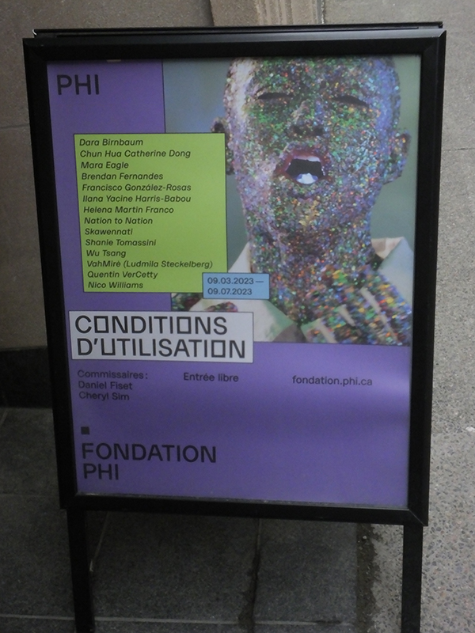
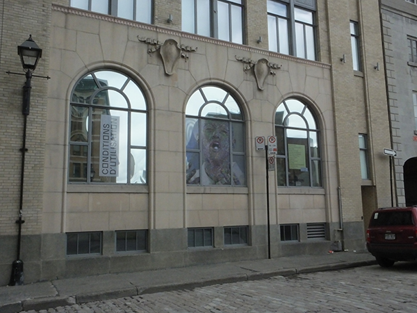

Photographies: Melody Chiasson
  
## Présentation de l'oeuvre ##
L’œuvre Unholy Ghost a été réalisée par l’artiste Mara Eagle en 2023. Unholy Ghost est une œuvre numérique et physique, combinant une vidéo de 5 minutes et 45 secondes ainsi que 4 sculptures imprimées d’un ange. 
 Selon une publication de la Fondation PHI sur Facebook, l’œuvre se décrit comme tel : 
> « Mélangeant animation 3D et prises de vue réelles, la vidéo de l’installation «Unholy Ghost» (2023) de Mara Eagle, médite sur les effets qu’a la reproductibilité technologique sur le corps d’une protagoniste qui oscille sans cesse entre deux espaces: l’un étant une chambre d’hôpital et l’autre, une expérience de réalité virtuelle. 
Sont aussi présentées dans l’installation des impressions 3D de chérubins en céramique qui font écho à des monuments funéraires captés par l’artiste au cours de son tournage, pointant vers un brouillage des frontières entre ce qui est fait par la machine et ce qui est fait à la main. »
 
Source : https://www.facebook.com/FondationPHI/posts/pfbid02mzHPAxC64xPRwpYkTwzcDoVuSpQCtKazpG8HVK4kXEZC3FL6QSmpybUPTxSJQFD8l
 
 

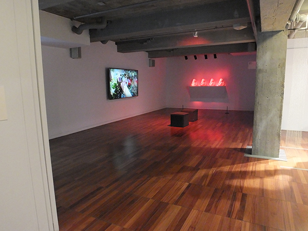

### Cartel ###

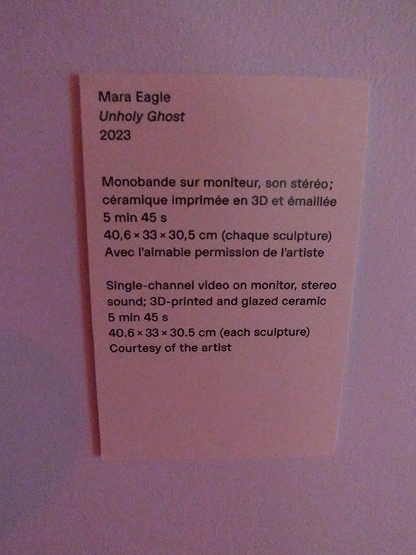

Photographie: Melody Chiasson

 

### Unholy Ghost ###

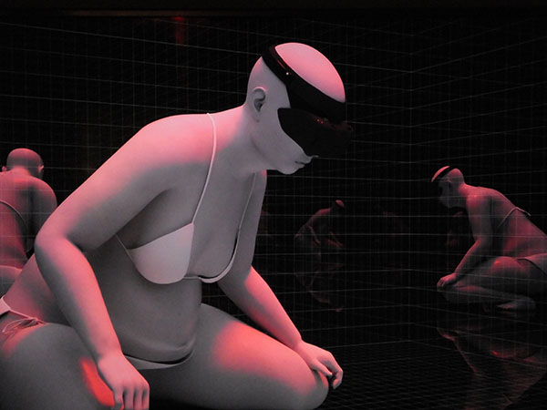

Photographie: Melody Chiasson

 

### Vidéo ###

Vidéo: Melody Chiasson

 
 
 ## Installation ##
Croquis de la vue de face, en entrant dans la pièce
 
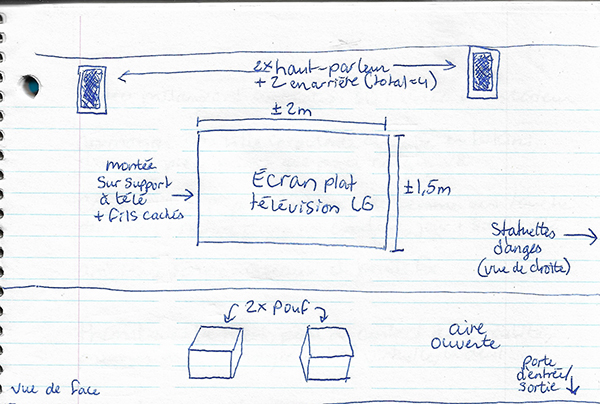
Croquis de la vue à droite, en entrant dans la pièce
 
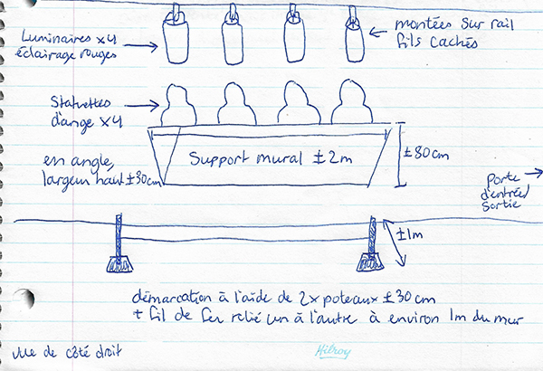

## Vue de droite - les anges ##
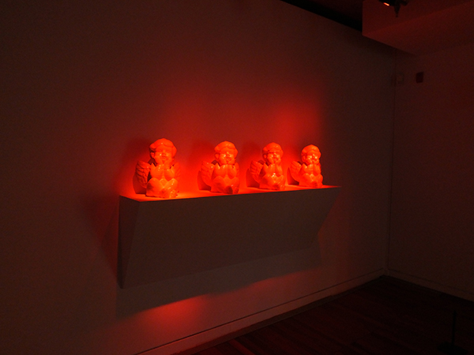
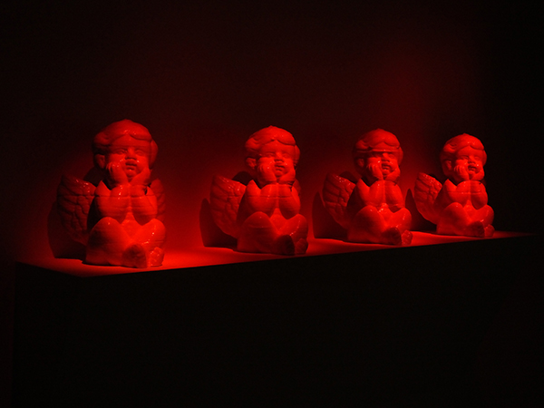
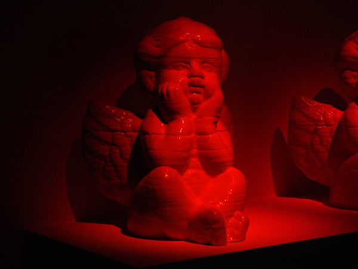
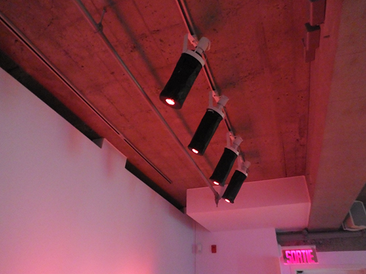
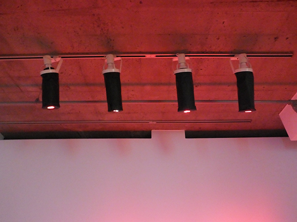
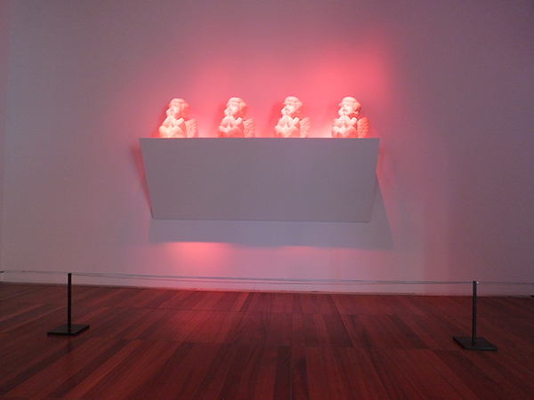
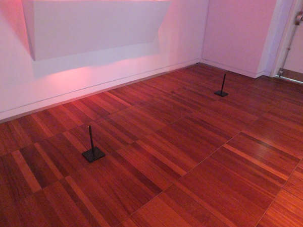

