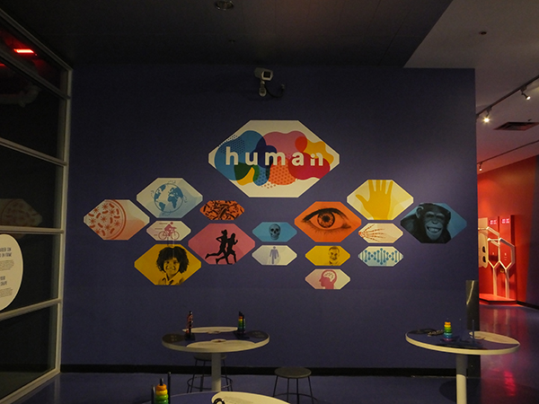

# Voir l’invisible – Humain #

## Présentation de l'installation ##

L’exposition Humain est présentée au Centre des sciences de Montréal. Cette exposition intérieure permanente présente des installations interactives éducatives à propos du fonctionnement du corps humain. L’exposition se décrit comme telle sur la page web du Centre des sciences de Montréal :
> « L’exposition propose de vivre les multiples métamorphoses de l’être humain depuis ses origines, de comprendre pourquoi et comment le corps se transforme à chacune des étapes de la vie. Amusez-vous à vous glisser dans la peau de l’autre et laissez-vous émerveiller par un regard unique sur la beauté et la richesse du corps humain. Vous êtes le résultat de millions de transformations. Vivez une expérience interactive qui vous aidera à découvrir votre place dans l’évolution humaine, à comprendre ce qui fait de vous ce que vous êtes et à entrevoir ce qui pourrait attendre l’être humain dans le futur avec la zone Le Futur! »
 
Source : https://www.centredessciencesdemontreal.com/exposition-permanente/humain
 
 

## Exposition ##

 
 
 
## Présentation de l'installation ##
Cartel
 
 

 
 
 
 ## Installation ##
 Mise en espace et description
  
  

 
 
L’installation Voir l’invisible est présentée dans une aire ouverte commune se trouvant au 2e étage du Centre des sciences de Montréal, au cœur de plusieurs autres installations. Elle est constituée de trois grandes caisses jaunes, mesurant environ 2,2 m de hauteur, par 1 m de largeur et 45 cm de profondeur. Un écran encastré se trouve dans chaque caisse, mesurant environ 1,5 m de hauteur par 80 cm de largeur. Les trois caisses sont disposées côte à côte en angle ressemblant à une accolade. 
 
 

 
 
Dans chacune de ces caisses se trouve une caméra encastrée en haut de l’écran. Chacune de ses caméras projette en temps réel sur son écran respectif la prise de vue qu’elle a du visiteur lorsque celui-ci se trouve en face des caisses. Un rayonnement différent est appliqué sur chaque caméra et celui-ci est dûment indiqué sur la caisse en dessous de l’objectif.
 
 

 
 
La première caisse capture la vidéo à l’aide d’un rayonnement ultraviolet et une lumière est installée sur le dessus de la caisse. La deuxième caisse capture la vidéo à l’aide de la lumière visible. La troisième caisse capture la vidéo à l’aide du rayonnement infrarouge.
 
 

 
 
Deux plaques se trouvent au sol, de la même dimension que les dalles, soit d’environ 45 cm. Deux questions y sont écrites afin d’amener le visiteur à s’interroger sur ce qui perçoit de lui-même dans les captures vidéo.
 
 

 
 
À droite des caisses se trouve une affiche mesurant environ 1,5 m de hauteur par 45 cm de largeur, accrochée sur un poteau d’environ 2 m de hauteur. Le titre de l’installation, un court texte et des illustrations y sont affichés.
 
 

 
 
L’arrière des caisses est verrouillé et une trappe d’aération se trouve dans le bas de chacune d’elles, probablement pour laisser s’échapper la chaleur des écrans et des caméras. Puisqu’aucun fils n’est visible, il est probable que ceux-ci se trouvent aussi à l’intérieur des caisses. 
 
 

 
 
## Aperçu vidéo de la mise en espace ##

 
 

## Expérience vécue ##
L’installation se trouve au cœur de plusieurs autres installations. Le visiteur doit explorer l’exposition afin de repérer cette installation en particulier. Lorsque le visiteur arrive devant l’installation, il les trois caisses jaunes ainsi que sa capture vidéo dans chaque écran. Il peut s’amuser et s’observer dans chaque écran.
 
 

## Aspects positifs ##
J’ai bien aimé le concept, c’était intéressant de pouvoir observer sa propre capture vidéo dans trois écrans sous l’effet de différent type de lumière.
 
 

## Aspects négatifs ##
J’ai trouvé très dommage qu’il n’y avait pas plus d’informations à propos des différents types de lumières. J’aurais aimé en savoir plus, même si l’exposition semble s’adresser aux enfants, j’estime qu’il aurait été pertinent de permettre aux petits comme aux grands d’avoir accès à plus d’informations. J’ai trouvé l’emplacement étrange et peu invitant. Selon mes observations sur place, peu de personnes remarquaient l’installation ou passaient rapidement devant celle-ci sans lui accorder davantage d’attention.
 
 

## Extrait vidéo de l'installation ##

 
 
## Sources médias ##
Photographies, vidéos et croquis: Melody Chiasson (sauf indication contraire).

