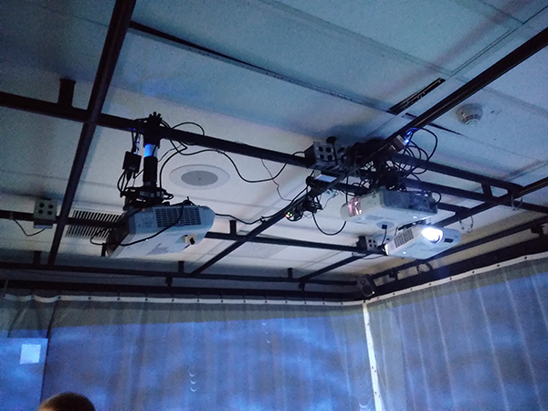

# Echomarine – Mycélium #
## Présentation de l'oeuvre ##
Echomarine est un projet synthèse réalisé par des étudiantes finissantes du programme de techniques d’intégration multimédia au collège Montmorency. Ces finissantes de la session d’hiver 2023 ont développées cette œuvre dans le cadre de l’exposition Mycélium, exposée sur le site du collège du 20 au 23 mars 2023. Selon la page web de leur projet, Echomarine se décrit comme tel :
> « Une projection immersive controlée par un dispositif interactif qui nous donne un aperçu de la beauté des fonds marins tout en mettant de l'avant ses enjeux. Animaux interactifs et plantes marines, Echomarine a un but contemplatif et vise à conscientiser. »

 

Source : https://tim-montmorency.com/2023/projets/Echomarine/docs/web/index.html
 
 

L’équipe derrière cette œuvre est composée d’étudiantes finissantes du programme TIM, soit : 

* **Florence Lapierre** :
https://tim-montmorency.com/2023/projets/Echomarine/docs/web/journal_1.html
* **Natacha Abdallah** :
https://tim-montmorency.com/2023/projets/Echomarine/docs/web/journal_2.html
* **Tracy Gua** :
https://tim-montmorency.com/2023/projets/Echomarine/docs/web/journal_3.html
* **Maria Laura Coronel Petit** :
https://tim-montmorency.com/2023/projets/Echomarine/docs/web/journal_4.html 

## Développement ##
Photographies de l’œuvre en développement dans le petit studio

 

 
 

## Schéma du projet ##
Schéma de plantation
 
Source : https://tim-montmorency.com/2023/projets/Echomarine/docs/web/preproduction.html

 

 
Schéma de branchement

 

Source : https://tim-montmorency.com/2023/projets/Echomarine/docs/web/preproduction.html

 

 
 

