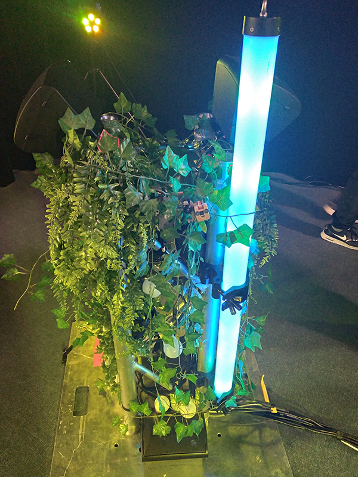
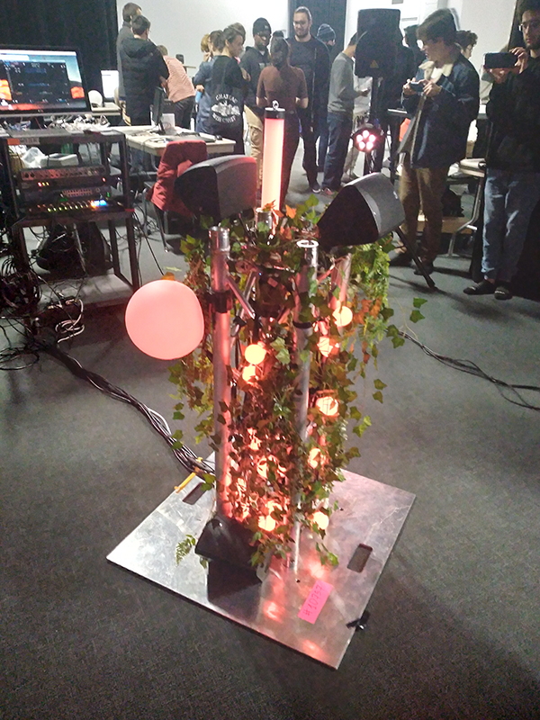
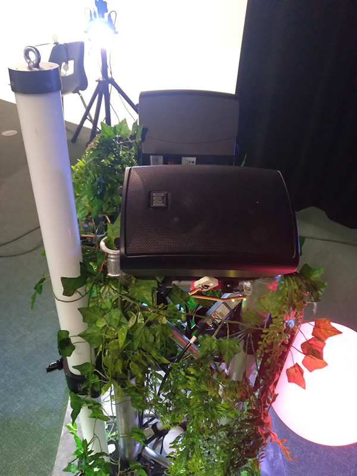
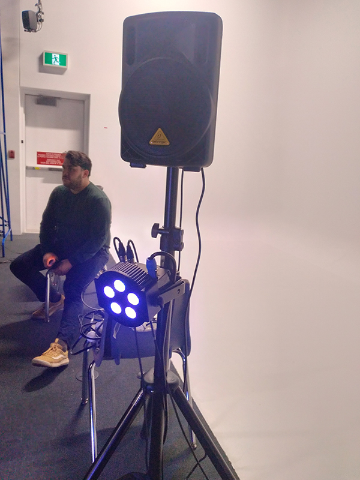
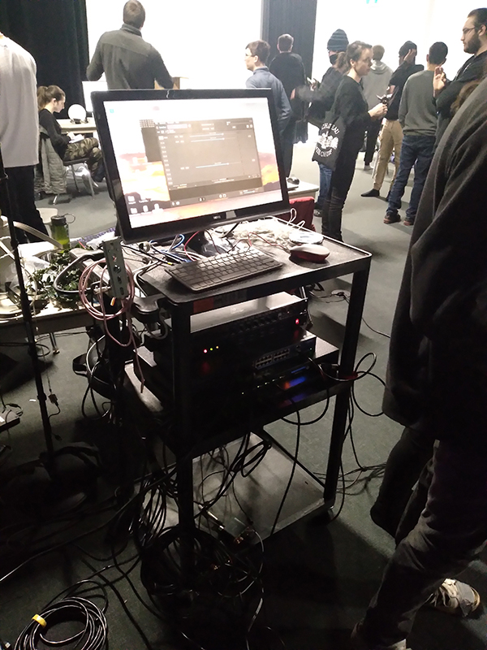
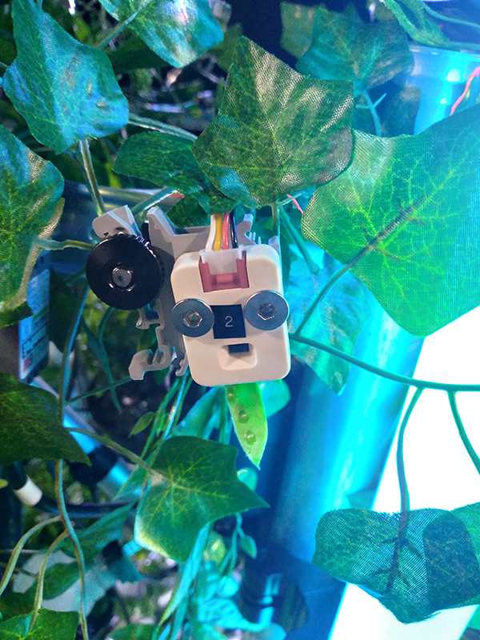
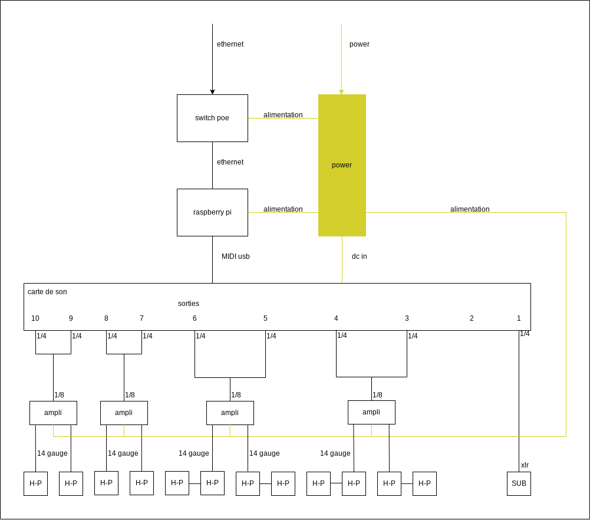
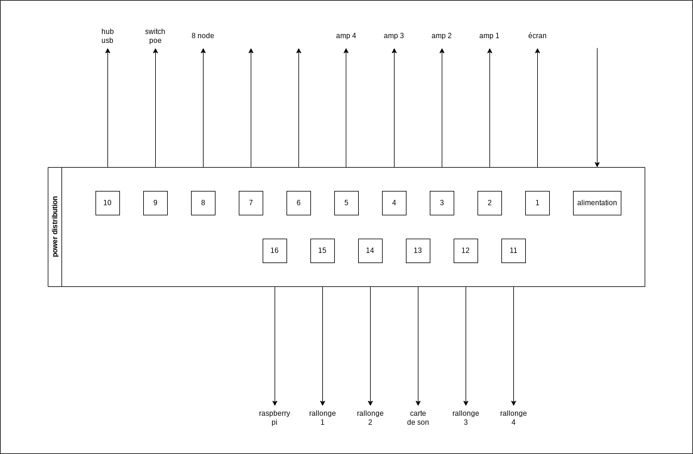
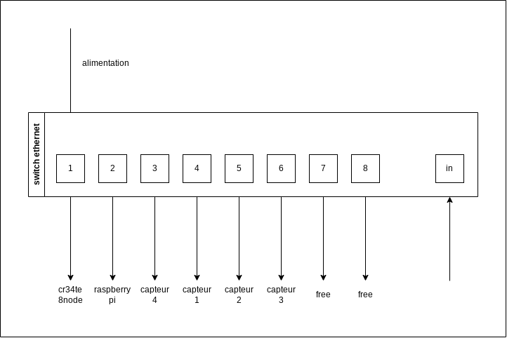
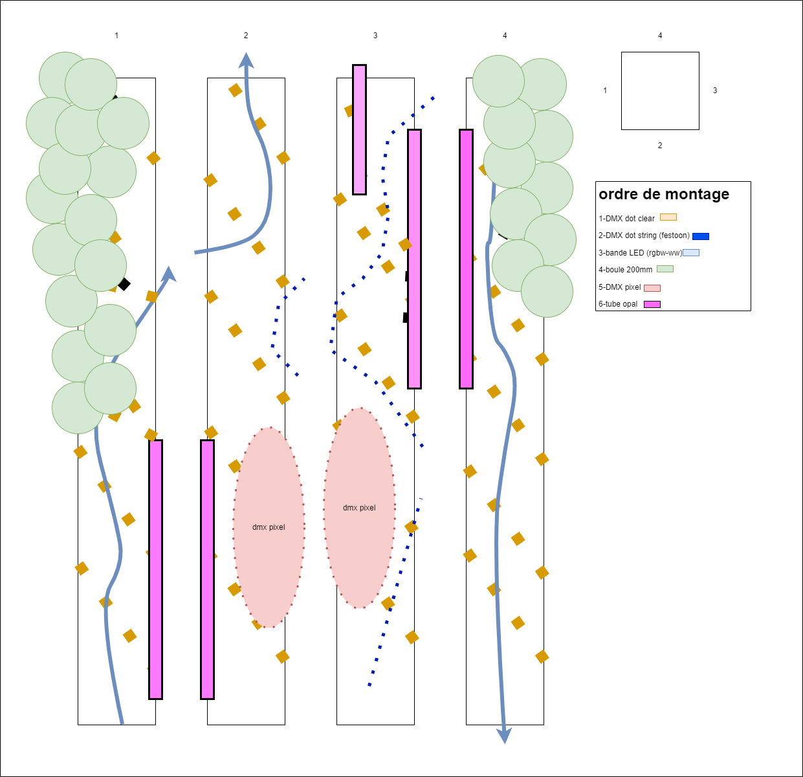

# Edria – Mycélium #

## Présentation de l'oeuvre ##

Edria est un projet synthèse réalisé par des étudiants finissants du programme de techniques d’intégration multimédia au collège Montmorency. Ces finissants de la session d’hiver 2023 ont développés cette œuvre dans le cadre de l’exposition Mycélium, exposé sur le site du collège du 20 au 23 mars 2023. Selon la page web de leur projet, Edria se décrit comme tel :

> « Traversant un hiver froid et glacial, des explorateurs arrivent en terre inconnue : EDRIA. Des piliers se dressent, et un écosystème hors de ce monde se dévoile sous leurs yeux. Une structure centrale attire l’attention des explorateurs. Intrigués, ils rentrent dans cette espace insolite et s'approchent de la dite structure: des lumières s'allument, des sons se déclenchent, et il semblerait que la présence de plusieurs personnes soit nécessaire pour progresser... »
> 
 

Source : https://tim-montmorency.com/2023/projets/EDRIA/docs/web/index.html

 

L’équipe derrière cette œuvre est composée d’étudiants finissants du programme TIM, soit :
 

* **Elwin Durand** :
https://tim-montmorency.com/2023/projets/EDRIA/docs/web/journal_1.html
* **Loic Delorme** :
https://tim-montmorency.com/2023/projets/EDRIA/docs/web/journal_2.html
* **Dominic Roberts** :
https://tim-montmorency.com/2023/projets/EDRIA/docs/web/journal_3.html
* **Gabriel Leblanc** :
https://tim-montmorency.com/2023/projets/EDRIA/docs/web/journal_4.html
* **Meryem Berbiche** :
https://tim-montmorency.com/2023/projets/EDRIA/docs/web/journal_5.html
* **Jean-Christophe Zephir** :
https://tim-montmorency.com/2023/projets/EDRIA/docs/web/journal_6.html

 
 

## Développement ##
Photographies de l’œuvre en développement dans le grand studio
 

 

## Schéma du projet ##

Schéma de branchement
 
Source : https://tim-montmorency.com/2023/projets/EDRIA/docs/web/preproduction.html
 

 

Schéma de branchement détaillé pour l'audio
 
Source : https://tim-montmorency.com/2023/projets/EDRIA/docs/web/preproduction.html

 

 

Schéma de branchement détaillé pour l'alimentation
 
Source : https://tim-montmorency.com/2023/projets/EDRIA/docs/web/preproduction.html

 

 

Schéma de branchement détaillé pour le distribution poe
 
Source : https://tim-montmorency.com/2023/projets/EDRIA/docs/web/preproduction.html

 

 

Schéma poteau central
 
Source : https://tim-montmorency.com/2023/projets/EDRIA/docs/web/preproduction.html

 

 

