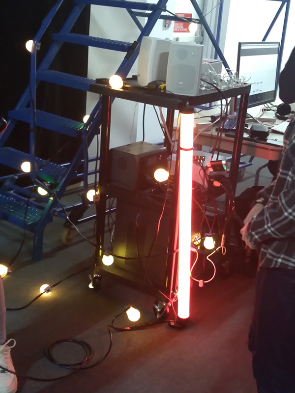
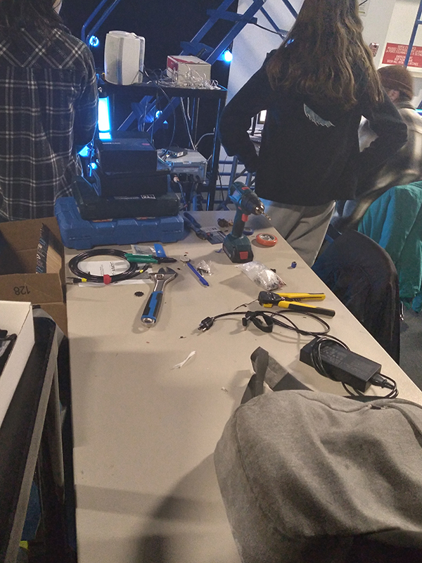
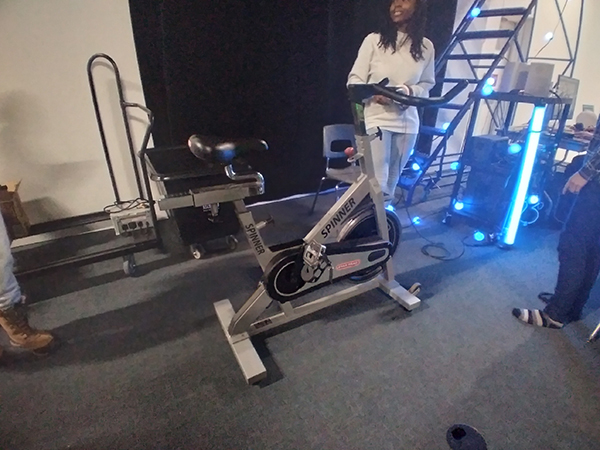
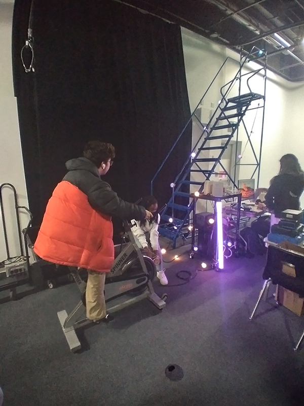

# Luma Sol – Mycélium #

## Présentation de l'oeuvre ##

Luma Sol est un projet synthèse réalisé par des étudiants finissants du programme de techniques d’intégration multimédia au collège Montmorency. Ces finissants de la session d’hiver 2023 ont développés cette œuvre dans le cadre de l’exposition Mycélium, exposée sur le site du collège du 20 au 23 mars 2023. Selon la page web de leur projet, Luma Sol se décrit comme tel :

> « Dans le cadre de ce projet, nous voulons démontrer l'importance pour les humains de demeurer en contact avec la nature en raison de l'urgence climatique que nous vivons actuellement. C'est par l'action, en pédalant dans ce cas, qu'on peut avoir un impact positif sur l'environnement lumineux. »
> 
 

Source : https://tim-montmorency.com/2023/projets/LumaSol/docs/web/index.html

 

L’équipe derrière cette œuvre est composée d’étudiants finissants du programme TIM, soit : 
 
* **Éloïse Gagné** :
https://tim-montmorency.com/2023/projets/LumaSol/docs/web/journal_1.html
* **Skayla Stimphil** :
https://tim-montmorency.com/2023/projets/LumaSol/docs/web/journal_2.html
* **Michaël Simard** :
https://tim-montmorency.com/2023/projets/LumaSol/docs/web/journal_3.html
* **Pénélope Morrisson** :
https://tim-montmorency.com/2023/projets/LumaSol/docs/web/journal_4.html

## Développement ##
Photographies de l’œuvre en développement dans le grand studio
 

 

## Schéma du projet ##

Schéma de branchement
 
Source : https://tim-montmorency.com/2023/projets/LumaSol/docs/web/preproduction.html
 

