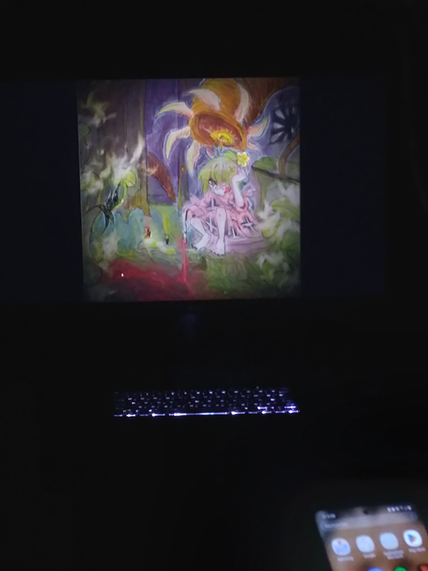
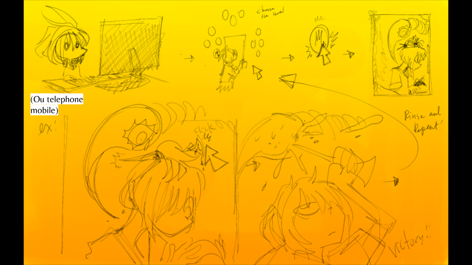

# Zodie Gal – Mycélium #

## Présentation de l'oeuvre ##

Zodie Gal est un projet synthèse réalisé par une étudiante finissante du programme de techniques d’intégration multimédia au collège Montmorency. Cette finissante de la session d’hiver 2023 a développé ce jeu dans le cadre de l’exposition Mycélium, exposé dans les locaux du collège du 20 au 23 mars 2023. Selon la page web de son projet, Zodie Gal se décrit comme tel :

> « Un jeu d'aventure qui se base sur la periode de puberte d'une jeune fille dans ses peurs d'adolescantes. Zodie Gal projet est un jeu web de touche et aventure où il faut aider une jeune fille à trouver des moyens de tuer des monstres Zodiac en cliquant sur le bon objet d’une image. Il y a 12 niveaux au total(baser sur le zodiac). Chaque niveaux contient 2 images: une image pour trouver le bon objet à utiliser contre le Zodiac et une image qui montre la victoire au joueur face au Zodiac. »
 

Source : https://tim-montmorency.com/2023/projets/Zodie-Gal/docs/web/index.html

 

Cette oeuvre a été réalisée par une étudiante finissante du programme TIM, soit : 
 
* **Abdanor Yara** :
https://tim-montmorency.com/2023/projets/Zodie-Gal/docs/web/journal_1.html
## Développement ##
Photographies de l’œuvre en développement dans le petit studio
 

## Schéma du projet ##

Schéma
 
Source : https://tim-montmorency.com/2023/projets/Zodie-Gal/docs/web/preproduction.html
 

 

Schéma
 
Source : https://tim-montmorency.com/2023/projets/Zodie-Gal/docs/web/preproduction.html

 

