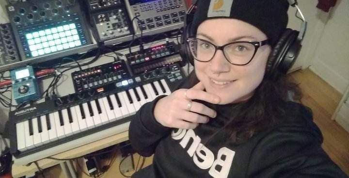

# Melody Chiasson, étudiante en TIM

## Mes intérêts dans le domaine du multimédia

Je suis intéressée par l'ensemble du domaine du multimédia et j'ai hâte d'en apprendre davantage au fil des prochaines sessions. J'aime la programmation, l'illustration, l'animation, la conception vidéo et sonore, le montage vidéo et sonore, la photographie, la conception et création de projet etc. Je m'étais déjà initiée par moi-même il y a plusieurs années à ces aspects du multimédia comme passe-temps. 

## Mes autres intérêts

J'aime apprendre la musique: la théorie, des instruments ainsi que la production. Je me considère encore comme une débutante mais ça fait déjà 2-3 ans que je me suis initiée à cela (voir mon setup sur la photo!) Sinon, j'aime bien l'artisanat (couture, crochet, point de croix), les chats, la cuisine et le plein-air. Fun fact: J'ai 31 ans et j'ai un DEP en horticulture! :blush:
